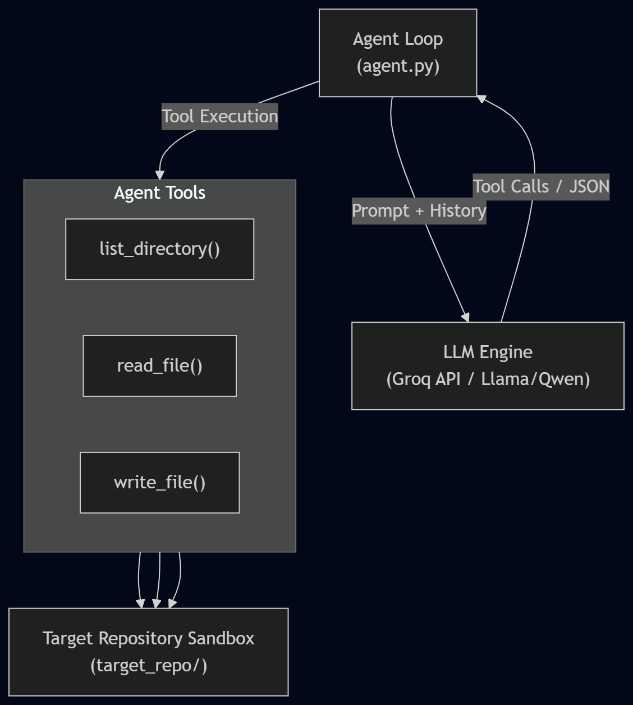

# Autonomous AI Coding Agent

An autonomous Python-based AI agent designed to inspect, reason about, and modify an existing Express.js & MongoDB repository (`node-easy-notes-app`) to implement new product requirements with minimal guidance.

---

## Architecture Overview

The system is designed around a tool-assisted agent loop powered by Large Language Models via the Groq API.



- **Core Engine:** Python 3.11+ using the Groq SDK to interface with high-reasoning models (`llama-3.3-70b-versatile` / `qwen-3-32b`).
- **State Management:** Conversational memory (`messages` array) tracking developer instructions, model reasoning steps, function outputs, and execution loops.
- **Resilience Layer:** Built-in exponential backoff and rate-limit retry handling to gracefully manage API token bucket constraints.

---

## Agent Workflow

1. **Initialization:** The agent receives a natural language task (e.g., _"Improve the application so users can better organise and search their notes"_).
2. **Exploration (Read Phase):** The agent executes directory listing tools to inspect the folder tree and reads target source files to deduce project architecture and dependencies.
3. **Planning:** The LLM synthesizes the existing codebase structure, identifies necessary modifications, and forms an execution plan.
4. **Execution (Write Phase):** The agent issues structured function calls to write or patch source code files.
5. **Validation & Completion:** The loop continues iteratively until the agent determines all requirements are met, terminating with a structured summary.

---

## Repository Exploration & Tooling

To ensure safety and efficiency, the agent uses three sandboxed tools targeting `target_repo/`:

- **`list_directory(path)`:** Traverses the file system while explicitly pruning noise like `node_modules/` and `.git/`. This prevents token exhaustion and context window overflow.
- **`read_file(file_path)`:** Safely extracts target file contents (UTF-8) for schema and route analysis.
- **`write_file(file_path, content)`:** Writes or overwrites code, automatically initializing missing parent subdirectories as needed.

---

## Key Assumptions & Trade-offs

- **Architecture Guardrails:** Language models often default to generating frontend components (e.g., React) when given broad organization requirements. The system prompt explicitly enforces architectural boundaries, constraining the agent to Express.js controllers and Mongoose schemas.
- **Full File Overwrites vs. AST Patching:** For small-to-medium codebases, overwriting whole target files via `write_file` ensures deterministic syntax generation compared to complex line-by-line diff patching.
- **Context Preservation:** Retaining full tool interaction history allows the model to "remember" file structures across iterations, though it increases token consumption toward later iterations.

---

## Setup & Running the Agent

### Prerequisites

- Python 3.11+
- Node.js & MongoDB (for running the modified application)

### Installation

**Clone the repository:**

```bash
git clone https://github.com/starJeet000/AI-Coding-Agent.git
cd ai-coding-agent
```

**Create and activate a virtual environment:**

```bash
python -m venv venv
source venv/bin/activate  # On Windows: venv\Scripts\activate
```

**Install dependencies:**

```bash
pip install groq python-dotenv    # or your preferred model
```

---

## Environment Setup:

**Create a `.env` file in the root directory:**

```bash
GROQ_API_KEY=your_groq_api_key_here     # variable = api key
```

**Clone Target Repository:**

```bash
git clone https://github.com/callicoder/node-easy-notes-app.git target_repo
```

**Run the Agent:**

```bash
python agent.py
```

---

### Checklist for Submitting Final Deliverables

To finalize your submission, complete the remaining steps:

#### Step A: Create a `.gitignore` File

Before pushing your code to GitHub, create a `.gitignore` file in your project root to ensure sensitive keys and cloned dependencies aren't uploaded:

```text
# Virtual Environment
venv/
.venv/

# Environment Variables
.env

# Target Application & Dependencies
target_repo/
__pycache__/
*.pyc
```
